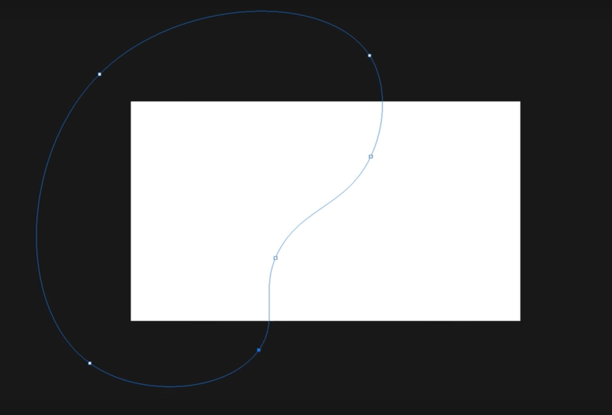

# Workshop UX / UI Design
## Pour les utilisateurs Linux
## Installation de PlayOnLinux

1. Cliquez sur ce lien <https://www.playonlinux.com/fr/download.html>
2. "Version de développement" Clonez ce repôt :
```
git clone https://github.com/PlayOnLinux/POL-POM-4
```
3. Revenez sur le site et en dessous de "Paquets" :
   * cliquez sur **Ubuntu**
   * choississez votre dépôt ( en l'occurrence Xenial sinon tapez les commandes du dépôt correspand )
   Pour le dépôt **Xenial**, tapez les commandes suivantes :
```
wget -q "http://deb.playonlinux.com/public.gpg" -O- | sudo apt-key add -
sudo wget http://deb.playonlinux.com/playonlinux_xenial.list -O /etc/apt/sources.list.d/playonlinux.list
sudo apt-get update
sudo apt-get install playonlinux
```
> PlayOnLinux est installé, voici son interface :


## Installation de Wine

Vérifiez d'abord si il est déjà présent via PlayOnLinux :
1. Allez sur PlayOnLinux
2. Cliquez sur l'onglet "Outils"
3. Ensuite allez sur "Gérer les versions de Wine"

> Résultat :


Si ce n'est pas le cas :

1. Allez sur le site de <https://www.winehq.org/>
2. Cliquez sur téléchargement
3. Dans *WineHQ Binary Packages* sélectionnez **Ubuntu**
4. Suivez les étapes :
```
sudo dpkg --add-architecture i386 
```
Download and add the repository key: 

```
wget -nc https://dl.winehq.org/wine-builds/winehq.key
sudo apt-key add winehq.key
```
Selon votre version ( dans ce cas, Ubuntu 16.04 )

```
sudo apt-add-repository 'deb https://dl.winehq.org/wine-builds/ubuntu/ xenial main' 
```
Update packages:

```
sudo apt update
```
Sur le site, il vous est demandé d'installer l'un des droits paquets "Then install one of the following packages".
Personnellement, j'ai choisi celui-ci : 

```
sudo apt install --install-recommends winehq-stable
```
> Wine est installé, veuillez vérifier via PlayOnLinux

## Installation de Photoshop et d'Illustrator CS6

1. Allez sur PlayOnLinux
2. Dans le panel à gauche, cliquez sur "installer un programme"
3. Vous arrivez dans une nouvelle fenêtre :


4. Choississez **graphisme**
5. Sélectionnez **Adobe Photoshop CS6**
6. Une fenêtre charge et cliquez sur "Parcourir"
7. Allez dans le dossier "Photoshop_13_LS6"
   * dossier "Adobe CS6"
   * Ouvrez le fichier "Set-up.exe"
7. Laissez Photoshop s'installer

> Vous aurez sûrement un message qui vous préviendra que si il y a un message d'erreur il faudra laisser 5 min à PlayOnLinux de l'installer.

8. Si vous avez ce message, attendez 5 minutes et appuyez sur "Suivant".
9. N'oubliez pas de couper internet
10. Cliquez sur "Essayer" (C'est très important)
11. Choississez la version d'évaluation
12. Faites la même chose pour Illustrator


   
**Recherche pour Canonical en cours** => Fonctionne avec la version Xenial

# Les consignes du projet UX/UI design


> Voici un aperçu du résultat

## UI_Design en format desktop

**Création du fichier**
1. Ouvrir Photoshop
2. Fichier
  * Nouveau ou Ctrl + n
3. Une nouvelle fenêtre s'ouvre, choisir un titre "UI Design desktop"
4. Paramètres prédéfinis
  * Choisir "web"
  * Largeur : 1920 px
  * Longueur : 1080 px
  * résolution : 300
> Un calque de base est créé, le renommer "background"

**Préparation du background**
1. Cliquer sur outil rectangle
2. Choisir "forme"
3. Créer 3 carrés
4. Les placer en haut à gauche
> Ce qui créera un nouveau calque, il est important de les nommer pour éviter un problème d'organisation

**Création de la forme dégradée**

1. Cliquer sur outil plume
2. Recopier la forme ci-dessus
  * Importer l'image dans Photoshop
  * Réaliser la forme
  * Supprimer l'image d'exemple
> N'oubliez pas de le renommer "gradient"

1. Cliquer sur le calque "background"
2. Cliquer sur l'outil dégradé
3. Une nouvelle fenêtre s'ouvre "éditeur de dégradé"
4. Créer les nouvelles couleurs
5. Double-cliquer sur un carré de couleur
  * 7991e4
  * 857ef5
  * 5f50c9
6. Enregistrer le nouveau dégradé
7. Appliquer le dégradé avec l'outil dégradé

1. Dupliquer le calque "gradient" (ctrl + J)
2. Retourner sur le 1er calque "gradient"
3. Le sélectionner à l'aide de l'outil rectangle
4. Lui appliquer la couleur 857ef5
5. Sélectionner le 2e calque "gradient (gradient 2)
  * Le déplacer vers la gauche
6. Sélectionner "gradient"
  * Outil rectangle pour sélectionner le tracé
  * Choisir flèche blanche pour le tracé
  * Modifier les courbes à l'aide des curseurs
7. Sélectionner les deux calques "gradient" et "gradient 2"
  * Flèche blanche
  * Modifier une nouvelles fois les courbes

**Création des montagnes**
1. Outil rectangle
2. Choisir polygone
  * Une nouvelle fenêtre s'ouvre "créer un polygone"
  * Largeur : 100 px
  * Longueur : 100 px
  * Nombre de côtés : 3
3. Onglet "édition"
  * Transformation du tracé
  * Rotation
  * -90°
4. Agrandir le triangle
5. Sélectionner la forme avec l'outil rectangle
6. Cliquer sur fond (en haut à gauche)
  * Choisir dégradé
  * Couleur du 1er carré (le plus clair)
> Le premier triangle est créé

1. Créer un 2e triangle pour l'ombre
2. Choisir l'outil plume (de base) 
3. Partir de la pointe du 1er triangle
> N'oubliez pas de nommer ce calque "ombre", le deuxième triangle est créé

1. Dupliquer le 1er triangle
2. Le descendre et le placer au milieu (plus ou moins)
3. Double-cliquer sur la vignette
4. Une nouvelle fenêtre "fond en dégradé"
  * Cliquer sur dégradé
  * Changer le carré blanc par la couleur de l'ombre (outil pipette)
  * Angle : -90*
5. Modifier l'opacité à 37%
> Troisième triangle créé
6. Le duppliquer
7. Le descendre plus bas que le précédent

1. Sélectionner tous les éléments "triangle" avec "majuscule + clique gauche"
2. Créer un groupe
3. Renommer "montagne"
> Votre première montagne est créée

1. Dupliquer le groupe (ctrl + J)
2. Redimensionner en plus petit (ctrl + t)
3. Placer la 2e montagne sur la droite
4. Cliquer sur fx (en bas à droite)
5. Choisir "ombre portée"
  * Opacité : 64%
  * Angle : 50
  * Distance : 87
  * Taille : 92
> Vous venez de créer une deuxième montagne avec une ombre portée

1. Dupliquer la 2e montagne et la placer sur la gauche
2. Cliquer sur fx
  * Opacité : 64
  * Angle : 122
  * Distance : 85
> Troisième montagne
3. Dupliquer une nouvelle fois la 3e montagne
4. fx :
  * Opacité : 100
  * Angle : 122
  * Distance : 0
  * Taille : 152
> Quatrième montagne

**Petite modification du background**
1. Sélectionner le calque "background"
2. Choisir outil de dégradé
3. Editeur de dégradé
4. Modifier le carré bleu (à gauche)
  * Double-cliquer
  * Nouvelle couleur : 5270d9
5. Modifier avec l'outil dégradé

**Création de nuages**
1. Outil rectangle arrondis
2. Créer la forme du nuage
3. Propriétés
  * Mettre 50 au lieu de 10px
4. Placer le calque "nuage" en-dessous du calque "gradient" **important**
5. Opacité : 25%
6. Dupliquer le calque "nuage"
7. Les modifier à votre guise
8. Créer un groupe et le nommer "nuages"

**Modification sur la 1er montagne**
1. fx :
  * Ombre portée
  * Taille à 177 px
> N'oubliez pas de faire ctrl + S assez souvent pour éviter des surprises

**Création d'étoiles**
1. Outil rectangle -> cercle
2. fx :
  * Lueur externe
  * Mode de fusion : normal
  * Opacité : 60%
  * Taille : 21 px
  * Etendue : 11%
3. Dupliquer votre étoile
4. Les disperser
5. Changer la taille sur quelques-unes
6. Créer un groupe et le nommer "étoiles"

**Création de la lune**
1. Outil rectangle -> cercle
2. Choisir flèche blanche
3. Modifier la lune à l'aide des curseurs
4. fx :
  * Lueur externe
  * Taille : 139 px

**Création d'étoiles filantes**
1. Outil rectangle arrondis
2. Comme les nuages mais en plus fin (comme un trait)
3. Cliquer sur fond
  * Cliquer sur l'icône du dégradé
  * Modifier le dégradé
4. Le dupliquer plusieurs fois
5. Modifier la taille sur quelques-unes
6. Créer un groupe et le nommer "étoiles filantes"

**Modification sur le calque gradient**
1. Cliquer sur le calque "gradient"
2. fx :
  * Ombre portée
  * Opacité : 100
  * Angle : 107
  * Distance : 55
  * Taille : 177 px
> Votre calque "gradient" a une ombre portée

**Modification sur le calque gradient2**
1. Sélectionner le calque "gradient 2"
2. Le dupliquer
3. Le placer sur le coin à gauche
4. Outil rectangle pour sélectionner le tracé
5. Cliquer sur le fond
6. Choisir l'icône dégradé
7. Modifier le dégradé
  * 1er carré (à gauche) : blanc
  * 2e carré (à droite) : e7e2ff
8. Cliquer sur l'icne "inverser les couleurs du dégradé"
