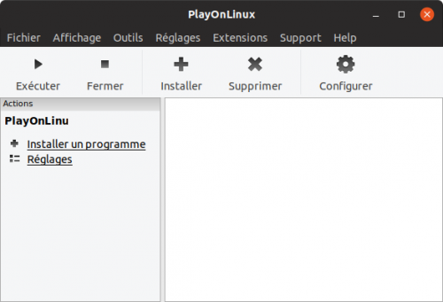
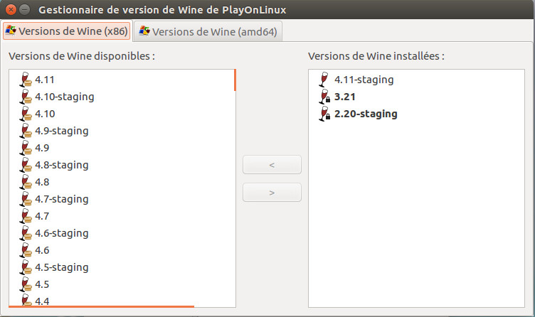
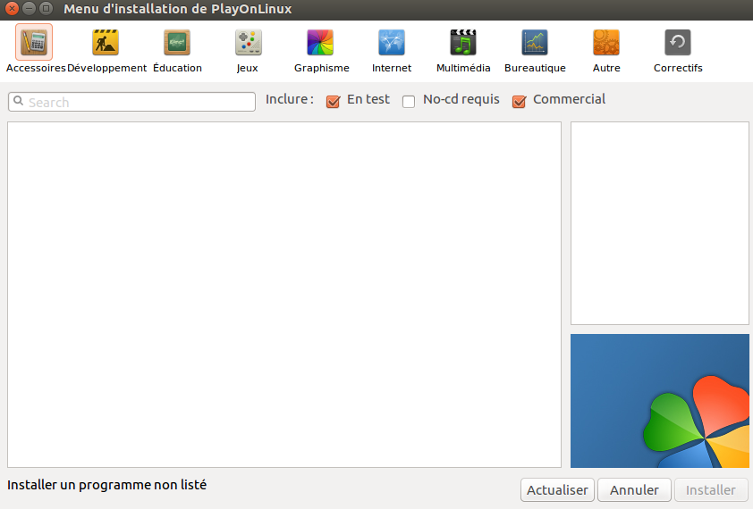

# Workshop UX Design
## Pour les utilisateurs Linux
## Installation de PlayOnLinux (consignes en cours)

1. Cliquez sur ce lien <https://www.playonlinux.com/fr/download.html>
2. "Version de développement" Clonez ce repôt :
```
git clone https://github.com/PlayOnLinux/POL-POM-4
```
3. Revenez sur le site et en dessous de "Paquets" :
   * cliquez sur **Ubuntu**
   * choississez votre dépôt ( en l'occurrence Xenial sinon tapez les commandes du dépôt correspand )
   Pour le dépôt **Xenial**, tapez les commandes suivantes :
```
wget -q "http://deb.playonlinux.com/public.gpg" -O- | sudo apt-key add -
sudo wget http://deb.playonlinux.com/playonlinux_xenial.list -O /etc/apt/sources.list.d/playonlinux.list
sudo apt-get update
sudo apt-get install playonlinux
```
> PlayOnLinux est installé, voici son interface :



## Installation de Wine

Vérifiez d'abord si il est déjà présent via PlayOnLinux :
1. Allez sur PlayOnLinux
2. Cliquez sur l'onglet "Outils"
3. Ensuite allez sur "Gérer les versions de Wine"

> Résultat :



Si ce n'est pas le cas :

1. Allez sur le site de <https://www.winehq.org/>
2. Cliquez sur téléchargement
3. Dans *WineHQ Binary Packages* sélectionnez **Ubuntu**
4. Suivez les étapes :
```
sudo dpkg --add-architecture i386 
```
Download and add the repository key: 

```
wget -nc https://dl.winehq.org/wine-builds/winehq.key
sudo apt-key add winehq.key
```
Selon votre version ( dans ce cas, Ubuntu 16.04 )

```
sudo apt-add-repository 'deb https://dl.winehq.org/wine-builds/ubuntu/ xenial main' 
```
Update packages:

```
sudo apt update
```
Sur le site, il vous est demandé d'installer l'un des droits paquets "Then install one of the following packages".
Personnellement, j'ai choisi celui-ci : 

```
sudo apt install --install-recommends winehq-stable
```
> Wine est installé, veuillez vérifier via PlayOnLinux

## Installation de Photoshop CS6

1. Allez sur PlayOnLinux
2. Dans le panel à gauche, cliquez sur "installer un programme"
3. Vous arrivez dans une nouvelle fenêtre :



4. Choississez **graphisme**
5. Sélectionnez **Adobe Photoshop CS6**
6. Une fenêtre charge et cliquez sur "Parcourir"
7. Allez dans le dossier "Photoshop_13_LS6"
   * dossier "Adobe CS6"
   * Ouvrez le fichier "Set-up.exe"
7. Laissez Photoshop s'installer

> Vous aurez sûrement un message qui vous préviendra que si il y a un message d'erreur il faudra laisser 5 min à PlayOnLinux de l'installer.

8. Si vous avez ce message, attendez 5 minutes et appuyez sur "Suivant".
9. N'oubliez pas de couper internet 
10. PlayOnLinux vous demandera un nom et une icône.
11. Faites la même chose pour Illustrator


   
**Recherche pour Canonical en cours**


