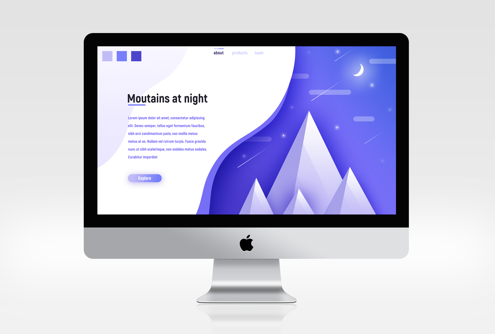
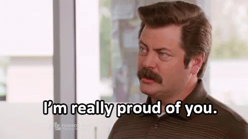

# Qu'est-ce que l'UX/UI Design ?

La première chose que vous devez savoir : 

> *You don't have to be born with it*

Eh oui, le design ça s'apprend et il consiste à résoudre des problèmes. C'est un processus de recherche constante de problèmes et de créations de solutions. Bah comme le développement web.. :smirk:

**UX ou User Experience** consiste à concevoir une interface accessible et facile à prendre en main pour tout type de support. C'est l'analyse des souhaits du client. A partir de là, on conçoit l'architecture du site ou de l'application ainsi que les différentes fonctionnalités de l'interface. Vous pouvez considérer que l'Ux est la face cachée de l'iceberg (comme le back-end en développement web) tandis que l'UI en est la partie visible (frontend).

**UI ou User Interface** consiste à concevoir une interface agréable aussi bien visuellement que manuellement. En gros, toute la créativité est mise en oeuvre (le choix des couleurs, des fonts, du logo, ...) pour réaliser la maquette graphique correspondant aux souhaits du client.

## Initiation

1. [Installation](installation.md)
2. [Photoshop](photoshop.md)
3. [Illustrator](illustrator.md)

## Exercice : Projet UX/UI Design

1. [Création du fichier](creation.md)
2. [Calque : background](prepa.md)
3. [Calque : gradient](gradient.md)
4. [Groupe : montagnes](montagne.md)
5. [Groupe : nuages](nuage.md)
6. [Groupe : étoiles](etoile.md)
7. [Calque : lune](lune.md)
8. [Groupe : étoiles filantes](etoilefilante.md)
9. [Modifcation : calque gradient](modifgradient.md)
10. [Modification : calque gradient2](modifgradient2.md)
11. [Groupe : texte](texte.md)
12. [Création du mockup](mockup.md)

> Voici un aperçu du résultat

**Vous venez de créer votre mockup desktop**

A vous de jouer et d'aller plus loin !

